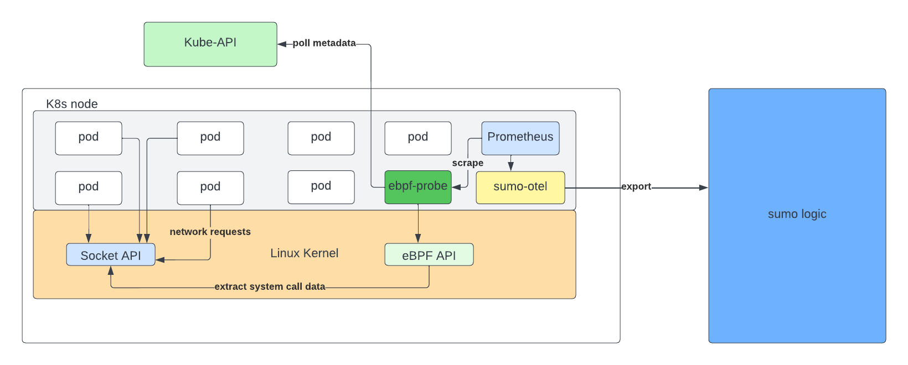

# K8s observability with eBPF

This project goes through steps to build and deploy our own eBPF probe into a Kubernetes cluster to collect insights about TCP data transfers.

## Description

Linux eBPF is a set of kernel features that allow the creation and execution of BPF programs within the Linux kernel at runtime. BPF programs
can be used for a variety of purposes, such as filtering network traffic, tracing kernel function calls, and more. The eBPF probe looks at every
open socket on a given node and parses out all of the socket buffer. From that, for example like an HTTP request, we can see how long your applications
are taking to respond to HTTP requests. Then we can associate that with the Kubernetes metadata. That socket's going to have two IPs, One could grab
that IP. See which pod corresponds to that IP. And then give you information like, "Hey, on this given pod, it's taking this long to respond to TCP
requests." Or parse out the actual HTTP body and say, like, "This pod saw an elevated spike in 500 errors."



## Getting Started.

### Dependencies

- A linux distribution with arm64 architecture

- Install linux headers on an Ubuntu 22.04(arm64) as below

```
sudo apt update
sudo apt install linux-headers-$(uname -r)
ls -l /usr/src/linux-headers-$(uname -r)
```

- A K8s cluster

### Installing

- To deploy the eBPF probe use the following command

```
kubectl apply -f deployment.yaml
```

`Note`: The image that the above command deploys is only compatible with arm64

[Optional] Deploy the [sumologic-kubernetes-collection](https://github.com/SumoLogic/sumologic-kubernetes-collection/blob/main/docs/installation-with-helm.md) helm chart, to send metrics to sumo logic.

- git clone https://github.com/SumoLogic/sumologic-kubernetes-collection
- Install the helm chart with the below user defined yaml like so

```
cd deploy/helm/sumologic
helm upgrade --install  -f my_values.yaml sumo .
```

- my_values.yaml

```
 sumologic:
  metrics:
    metadata:
      provider: fluentd
  collector:
    sources:
      metrics:
        ebpf_source:
          name: ebpf-source
      traces:
        otlp:
          name: otlp
          properties:
            content_type: Otlp
  accessId: <access-id>
  accessKey: <access-key>
  endpoint: "<endpoint>"
kube-prometheus-stack:  # Add to a user-supplied user-values.yaml
  prometheus:
    prometheusSpec:
      additionalRemoteWrite:
        - url: http://$(METADATA_METRICS_SVC).$(NAMESPACE).svc.cluster.local.:9888/prometheus.metrics.kube-ebpf
          writeRelabelConfigs:
          - action: keep
            regex: 'kube_ebpf_request_exchanged_created'
            sourceLabels: [__name__]
fluentd:
  metrics:
    output:
      ebpf_source:  # It matches sumologic.collector.sources.my_source
        tag: prometheus.metrics.kube-ebpf # tag used by Fluentd's match clause
        id: sumologic.endpoint.metrics.kube-ebpf
  buffer:
    filePaths:  # required if fluentd.buffer.enabled is true
      metrics:
        ebpf_source: /fluentd/buffer/metrics.ebpf_source
 ```

### Executing program

- The eBPF probe (pod) should automatically start collecting data from all the pods in the cluster

One can also see all the metrics that are being collected from the pods using the curl command, like so:

```
curl localhost:8000/metrics
```

## Help

This project only works with on an ARM64 machine

```
uname -a
```

## Authors

- Raj Nishtala
- James Xie

## Version History

- 0.1
  - Initial Release

## Acknowledgments

- [eBPF](https://medium.com/@isalapiyarisi/getting-started-on-kubernetes-observability-with-ebpf-88139eb13fb2)
- [Install linux headers](https://www.tecmint.com/install-kernel-headers-in-ubuntu-and-debian/)
- [MrSupiri](https://github.com/MrSupiri/kube-ebpf)